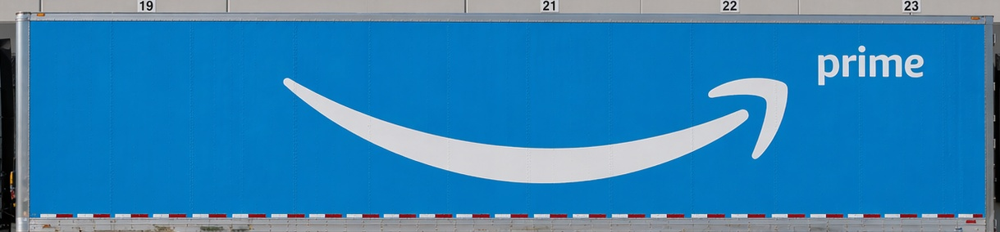
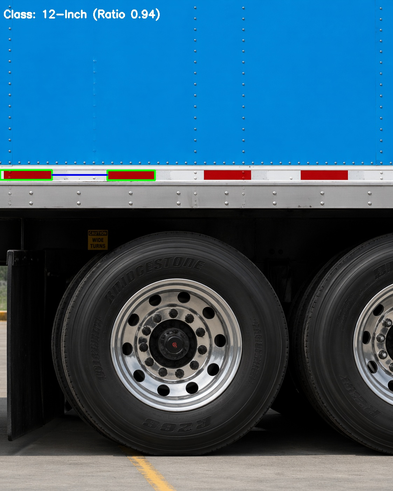
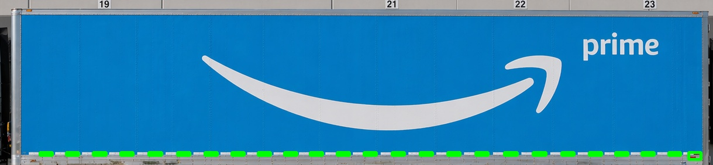
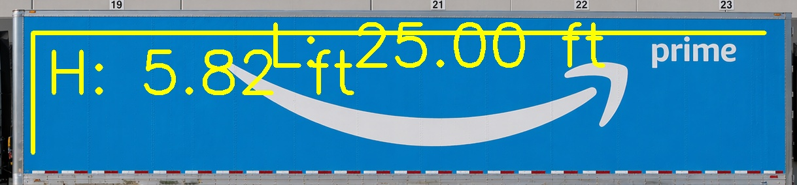
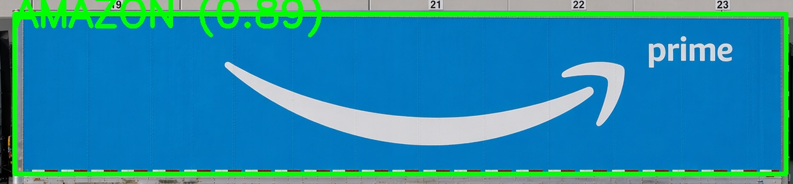
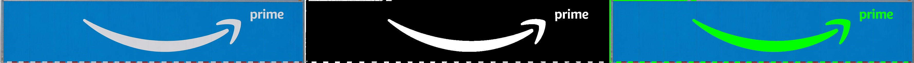

# 🚚 Automated Fleet Measurement & Logo Ink Yield Analysis

An end-to-end Computer Vision pipeline designed to automatically measure commercial fleet trailers and calculate the exact square footage of billable vinyl/ink required for branding. 

By analyzing two standard photographs (a macro shot of the trailer and a micro close-up of the DOT-C2 tape), this system flattens perspective distortion, dynamically scales measurements to real-world geometry, and performs pixel-perfect ink extraction.

---

## 🔗 Quick Links
* **Live Test Deployment:** https://lowen-frontend-final.vercel.app/
* **Dataset Used:** https://app.roboflow.com/traail/truck-trail/6, https://app.roboflow.com/traail/tlogo-detection/1
---

## 🧠 The Architecture & Pipeline

This system completely replaces manual tape-measure estimates with a 5-step AI pipeline:

1. **AI Perspective Flattening (Homography):** Uses a custom YOLO model to detect the corners of the trailer side panel and mathematically warps the image into a perfect 2D flat canvas.
2. **Dynamic Scale Calibration:** Analyzes a close-up image of the trailer's reflective DOT-C2 tape. It isolates the red/white gaps and dynamically classifies the pattern as either a 12-inch or 18-inch industry standard.
3. **Statistical Noise Filtering:** Scans the flattened trailer canvas, detects all tape strips, applies a median-width statistical filter to remove glare/noise, and counts the strips to calculate exact real-world length and square footage.
4. **Semantic Fleet Detection:** Runs a second custom YOLO model to identify the corporate fleet brand (Amazon, FedEx, Costco, Walmart, etc.) and determines the specific manufacturing requirement (Single Unit Wrap vs. Discrete Decals).
5. **True Ink Area Extraction:** Crops the detected logo and applies Otsu's Thresholding to perfectly separate the logo ink from the trailer background, calculating the exact billable square footage of vinyl used.

---

## 💻 Tech Stack

* **AI/ML:** Ultralytics (YOLOv8)
* **Computer Vision:** OpenCV (cv2), Numpy
* **Language:** Python 3

---

## 🚀 Installation & Setup

Follow these steps to get the pipeline running on your local machine.

### 1. Clone the repository
```bash
git clone [https://github.com/lokaesh2000/lowen-project1.git](https://github.com/lokaesh2000/lowen-project1.git)
cd lowen-project1
```

### 2. Set up a Python Virtual Environment
```bash
python3 -m venv venv
source venv/bin/activate
```

### 3. Install Dependencies
```bash
pip3 install -r requirements.txt
```

### 4. Add your AI Models
Ensure you have downloaded your custom YOLO weights and placed them in the root of this folder. They must be named:
trailer_best.pt
logo_best.pt

## ⚙️ How to Run
The script runs completely headlessly in your terminal and requires exactly two input images: a wide shot of the trailer, and a close-up of the tape.
for robust resting with edge cases us this love demo https://lowen-frontend-final.vercel.app/
Command:
```bash
python3 main.py macro.png micro.png
```

## 📊 Outputs
When the pipeline finishes, it will generate two distinct outputs:

### 1. The Terminal Manifest
A formatted text report printed directly to your console detailing the fleet owner, calculated length, trailer height, total area, manufacturing type, and exact billable vinyl requirements.

### 2. Visual Proofs
The script will silently generate and save 6 high-resolution JPEG images into your project folder.

Here is a step-by-step breakdown of the AI pipeline in action on a sample trailer:

**1. AI Perspective Flattening**


**2. Dynamic Scale Calibration**


**3. Statistical Noise Filtering**


**4. Physical Dimension Calculation**


**5. Semantic Fleet Detection**


**6. True Ink Area Extraction**

